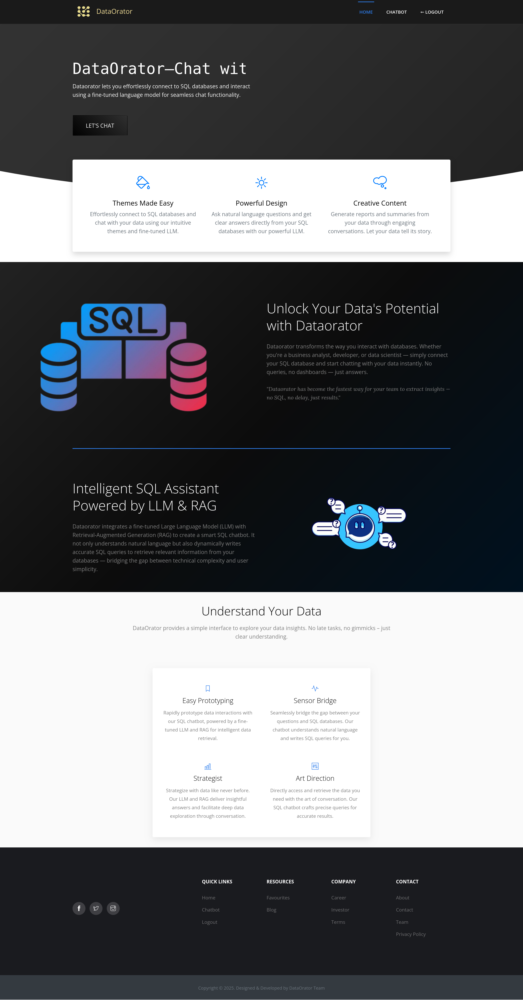
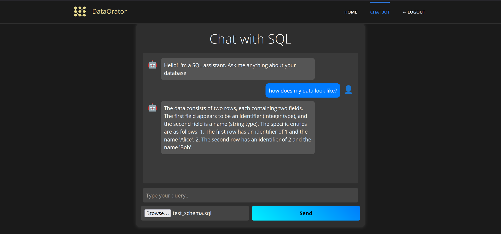

# Web Interface for Data Orator

## Usage

1. Install the required packages:
	```bash
	pip install -r requirements.txt
	```

2. Install [orator package](../package/orator/README.md)

3. Run Locally
	```py
	python app.py
	```

## Home Page


## Login Page


## SignUp Page


## Chatbot Page

